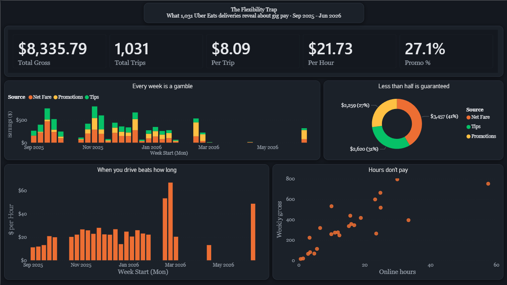

# The Flexibility Trap
### What 1,031 Uber Eats deliveries reveal about gig pay


An end-to-end data analytics project built on **my own real Uber Eats earnings** - ten months, 25 active weeks, 1,031 deliveries. It takes raw weekly app screenshots all the way through cleaning, modeling, and a designed Power BI report, and turns the numbers into a single uncomfortable finding: **the part of gig pay you can actually count on is less than half of it.**

> 📊 **[Live dashboard ›](#)** &nbsp;·&nbsp; built with Power BI · Power Query · DAX



---

## TL;DR — Key Findings

| Metric | Value |
|---|---|
| **Total gross** | $8,335.79 |
| **Deliveries** | 1,031 |
| **Online hours** | 383.7 |
| **Effective rate** | $21.73 / hour · $8.09 / trip |
| **Weekly range** | $13 → $795 |
| **Best vs. worst hour** | $67/hr vs $11/hr (≈ 6× gap) |

**Where the money actually comes from:**

| Source | Amount | Share | Driver controls it? |
|---|---|---|---|
| **Net Fare** (base) | $3,456.67 | **41.5%** | ✅ Guaranteed |
| **Tips** | $2,619.72 | 31.4% | ❌ Customer-dependent |
| **Promotions** | $2,258.50 | 27.1% | ❌ Algorithm-dependent |

> **The headline:** Base fare - the only part Uber guarantees — is the largest single source, but still **less than half**. The other **58.5%** of income came from tips and promotions: variable, unpredictable, and outside the driver's control.

---

## The Story 

This project is framed as a three-act data story, and the report's visual titles carry the narrative.

**🟢 *"The side hustle that adds up."***
The promise is simple: drive when you want, get paid per delivery. Over ten months it totaled $8.3K across 1,031 trips at $21.73/hour. On paper, flexible and dependable.

**🟠 *"But you don't control the money."***
- *Less than half is guaranteed* - base fare is only 41.5% of earnings.
- *Every week is a gamble* - weekly gross swung from $13 to $795 with no plannable pattern.
- *Hours don't pay* - the best week earned $67/hr, the worst $11/hr; logging more hours didn't reliably mean more money.

**🔵 *"Timing beats grinding."***
The highest-earning hours weren't the longest weeks - they were short, promotion-timed ones. The lever a driver actually controls isn't *how many* hours, it's *which* hours.

> *Gig "flexibility" is real — but so is the instability it hides. The data shows the only reliable strategy is selectivity.*

---

## Tools & Skills Demonstrated

- **Power Query (ETL)** - cleaning, header promotion, type enforcement, null filtering, and an unpivot transformation to reshape wide data into a tidy long format.
- **Data modeling** - a clean fact table plus a derived "by source" query feeding the composition visuals.
- **DAX** - KPI measures for rate, efficiency, and mix.
- **Data storytelling** - every visual titled to advance a narrative, not just describe an axis.

---

## Process — The Steps I Took

**1. Collect.** Pulled weekly earnings straight from the Uber Eats *Earnings* tab — for each week: Net Fare, Promotions, Tips, Other, Total, Online Hours, Trips, and Points.

**2. Structure.** Built a single source of truth Excel workbook: one row per week (25 active weeks), plus totals and a summary block.

**3. Clean (Power Query).** On import, removed Power BI's auto generated *Promoted Headers* / *Changed Type* steps, stripped the title rows, promoted the real header, then **filtered out null `Week Start` rows** to drop the totals/summary lines - leaving exactly 25 clean weekly records. Set explicit data types on every column.

**4. Reshape (unpivot).** Created a **reference query**, `Earnings by Source`, keeping `Week Start` + the three income sources, then **unpivoted** them into a tidy long table (`Week · Source · Amount` = 75 rows). This is what powers the composition donut and the stacked column by source.

**5. Measure (DAX).** Wrote the KPI measures:

```dax
Total Gross = SUM('Weekly Earnings'[Total Earnings])

Total Hours = SUM('Weekly Earnings'[Online Hours])

Total Trips = SUM('Weekly Earnings'[Trips])

$ per Hour  = DIVIDE([Total Gross], [Total Hours])

$ per Trip  = DIVIDE([Total Gross], [Total Trips])

Promo %     = DIVIDE(SUM('Weekly Earnings'[Promotions]), [Total Gross])
```

**6. Visualize.** Built five visuals mapped to the story — KPI cards (Setup), donut + stacked column + scatter (Conflict), and a $/hour efficiency column (Resolution).

**7. Design.** Applied a custom dark theme in Uber's palette (Eats green `#06C167`, yellow `#FFC043`, accent orange `#ED6E33`, near-black canvas `#14181F`) and rewrote every chart title to carry the narrative.

**8. Validate.** Cross checked the source breakdown against the raw weekly totals to confirm the composition percentages before publishing - base fare 41.5% / tips 31.4% / promotions 27.1% reconcile to the $8,335.79 gross.

---

## Repo Contents

```
.
├── README.md                       ← you are here
├── dashboard.png                   ← report screenshot
├── Uber_Earnings_Report.pbix       ← the Power BI project
├── theme.json                      ← custom Uber dark theme
├── data/
│   ├── Uber_Earnings_Full_Record.xlsx   ← cleaned weekly record
│   └── uber_weekly_earnings.csv         ← reproducible dataset
└── html-version/
    └── gig_earnings_dashboard.html      ← Chart.js build (open in browser)
```

---

## How to View

- **Power BI:** open `Uber_Earnings_Report.pbix` in Power BI Desktop. The theme is already embedded; to reuse it elsewhere, import `theme.json` via *View → Themes → Browse for themes*.

---

## Notes & Next Steps

- **Sample scope:** one driver, one market (Northern NJ), food delivery only - directional, not a population level claim.
- **Collection:** earnings were transcribed manually from the app. A natural extension is pulling the official Uber 1099 / monthly summaries programmatically.
- **What I'd add next:** time-of-day and day-of-week dimensions to test the "timing beats grinding" hypothesis directly, and a weather join to see how surge/promotions track demand.

---

## About

Built by **Cris Ramirez**

🔗 **GitHub:** [@iSwaidy](https://github.com/iSwaidy)
